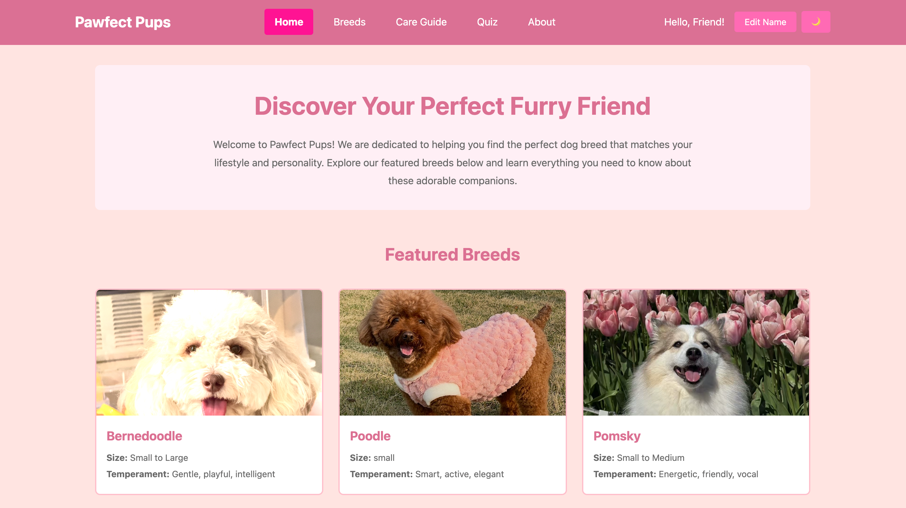
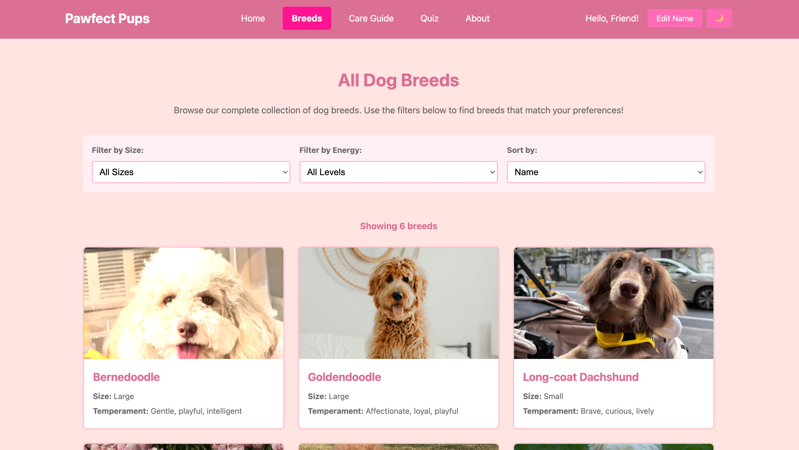
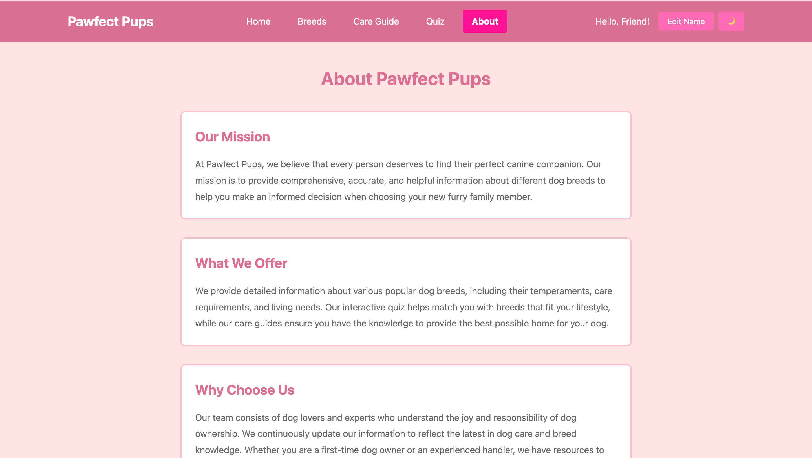

Doggies Home 🐶

Interactive dog-breed website (NEU Final) built with React + Vite.
Live demo: https://yunzhuchen0123.github.io/doggies-home/

This repo mirrors the structure of a portfolio-friendly project:

Source code in vite-project/

Static site in docs/ (for GitHub Pages)

✨ Features

Home / Breeds / Care / About / Quiz five views

Breed Cards: image + traits (componentized DogCard)

Interactive Quiz: simple questions → gives breed suggestions

Responsive Layout: works on mobile / tablet / desktop

Accessibility: skip-to-content, labeled forms, alt text, focus styles

Clean CSS organization: src/styles/*.css per-page + global.css

Image assets in public/ for straightforward referencing

🚀 Getting Started (Local Dev)
cd vite-project
npm install
npm run dev
# open the shown URL, usually http://localhost:5173/

🧱 Scripts
npm run dev       # start Vite dev server
npm run build     # production build
npm run preview   # preview built site locally

🔧 Vite Config for GitHub Pages

vite-project/vite.config.js：

import { defineConfig } from 'vite'
import react from '@vitejs/plugin-react'

// IMPORTANT: update base if you rename the repo
export default defineConfig({
  plugins: [react()],
  base: '/doggies-home/',     
  build: { outDir: '../docs' } 
})

Build & publish to docs/:

cd vite-project
npm run build
cd ..
git add docs
git commit -m "build: publish site to docs"
git push

Then enable GitHub Pages:
Settings → Pages → Source = Deploy from a branch → Branch = main / Folder = /docs.

🧭 Routing Note

This project uses simple view components (no external router).
If you add React Router later for more routes, keep base set to /doggies-home/ and ensure assets use paths that work on Pages.

✅ Course Requirements Mapping (sample)

Semantic HTML & accessible forms ✔ (label + aria-*, focus styles)

Responsive layout ✔ (CSS breakpoints; fluid grid/cards)

Multi-page/views ✔ (Home / Breeds / Care / About / Quiz)

Interactive feature ✔ (Quiz with state)

External assets & attribution ✔ (see licenses.txt)

Clear repo structure ✔ (source vs. docs, README included)

📸 Screenshots

 

🧾 License & Credits

Images: see vite-project/licenses.txt for attributions and allowed use.

✍️ Author

Ruby Chen (Yunzhu Chen)
GitHub: https://github.com/yunzhuchen0123
