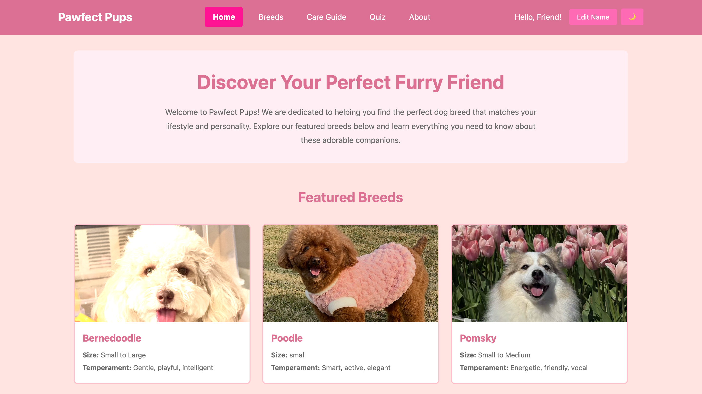
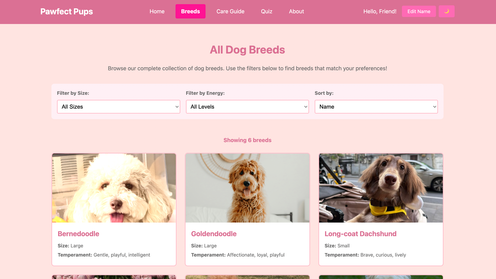
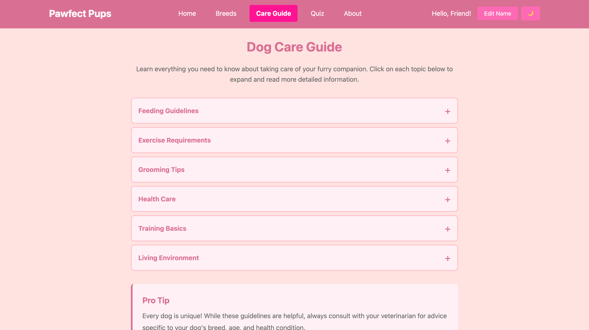
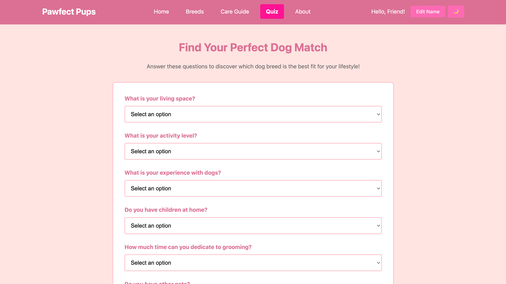
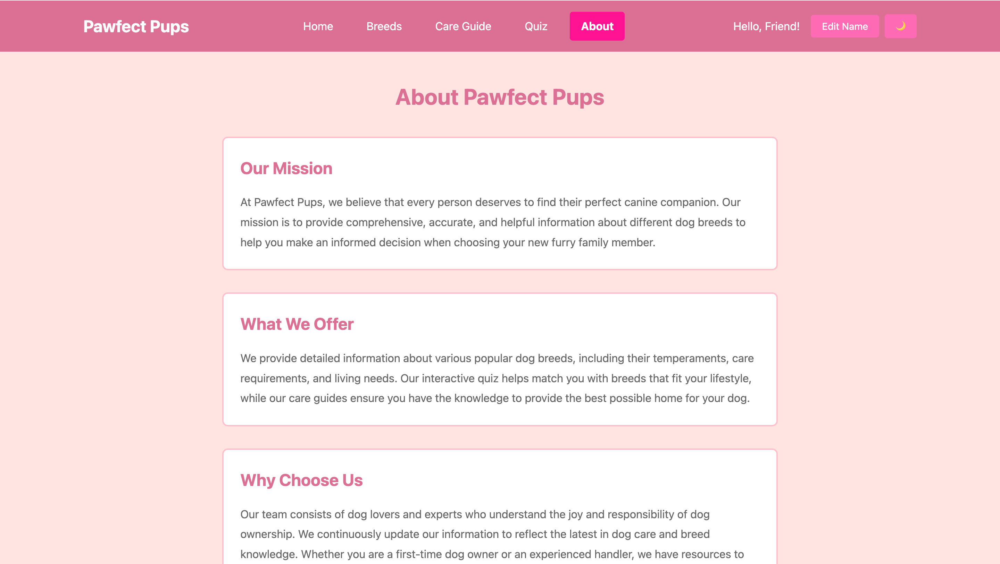

# 🐶 Pawfect Pups

A modern React web application for dog breed exploration, featuring **AI-powered breed identification** using TensorFlow.js.

**Live Demo:** https://yunzhuchen0123.github.io/doggies-home/

---

## ✨ Features

### 🤖 AI Breed Identifier
Upload any dog photo and get instant breed recognition powered by TensorFlow.js — runs entirely in the browser with no server required.

### 🏠 Core Features
- **6 Interactive Pages** — Home, Breeds, Care Guide, Quiz, About, AI Identify
- **Smart Breed Quiz** — Answer questions to find your perfect dog match
- **Breed Gallery** — Filter by size/energy, sort by name
- **Care Guide** — Expandable accordion sections with dog care tips
- **Dark/Light Theme** — Toggle with localStorage persistence
- **Personalized Greeting** — Edit and save your name

### ♿ Accessibility
- Skip-to-content link
- Semantic HTML structure
- ARIA attributes for interactive elements
- Keyboard navigation support
- prefers-reduced-motion support

### 📱 Responsive Design
- Mobile-first approach
- Adaptive hamburger menu
- Fluid grid layouts
- Works on all screen sizes (360px - 1920px+)

---

## 🛠️ Tech Stack

| Category | Technologies |
|----------|-------------|
| Frontend | React 18, JavaScript ES6+ |
| AI/ML | TensorFlow.js, MobileNet |
| Styling | CSS3, BEM methodology |
| Build | Vite |
| Deployment | GitHub Pages |

---

## 🚀 Getting Started

git clone https://github.com/yunzhuchen0123/doggies-home.git
cd doggies-home/vite-project
npm install
npm run dev

Open http://localhost:5173/doggies-home/ in your browser.

---

## 📸 Screenshots

| Home | Breeds | Care Guide |
|------|--------|------------|
|  |  |  |

| Quiz | About |
|------|-------|
|  |  |

---

## 📝 License & Credits

- Personal dog photos owned by the author
- Additional images from Unsplash (see vite-project/licenses.txt)
- AI model: TensorFlow.js MobileNet

---

## 👩‍💻 Author

**Ruby Chen** (Yunzhu Chen)

GitHub: https://github.com/yunzhuchen0123