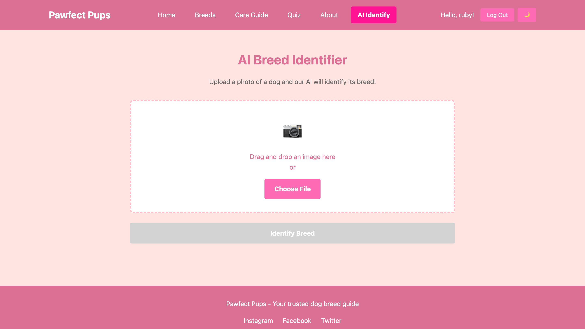
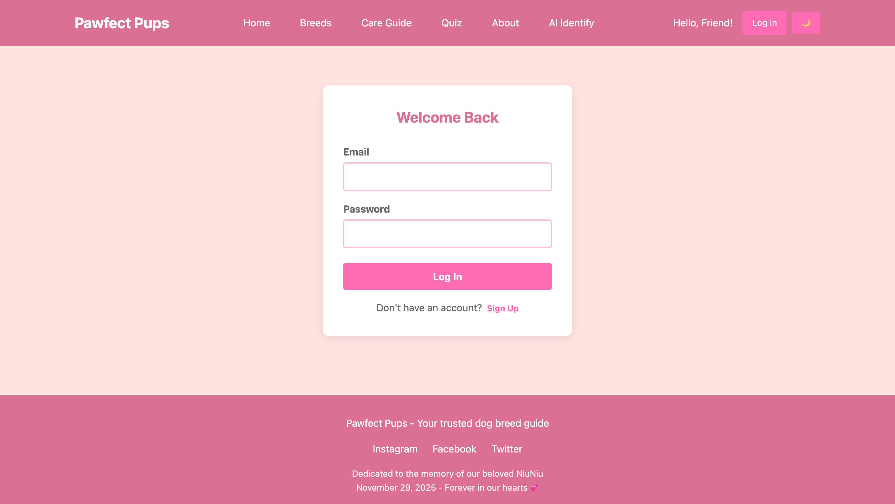

# 🐶 Pawfect Pups

A full-stack React application for dog breed exploration, featuring **AI-powered breed identification** with TensorFlow.js and **user accounts** backed by Node/Express and MongoDB.

**Live Demo:** https://yunzhuchen0123.github.io/doggies-home/  
**API:** https://pawfect-pups-api.onrender.com


---

## ✨ Features

### 🤖 AI Breed Identifier
Upload any dog photo and get instant breed recognition powered by TensorFlow.js — the MobileNet model runs entirely in the browser, so images never leave the user's device and no inference server is needed.



### 🔐 User Accounts
Register and log in with JWT authentication. Signed-in users get:
- **Saved favorites** — bookmark breeds, persisted in MongoDB across sessions and devices
- **Quiz history** — past quiz results stored on the account

Passwords are hashed with bcrypt; protected routes derive the user id from the verified token rather than trusting the client.



### 🏠 Core Features
- **6 Interactive Pages** — Home, Breeds, Care Guide, Quiz, About, AI Identify
- **Smart Breed Quiz** — Answer questions to find your perfect dog match
- **Breed Gallery** — Filter by size/energy, sort by name
- **Care Guide** — Expandable accordion sections with dog care tips
- **Dark/Light Theme** — Toggle with localStorage persistence
- **Personalized Greeting** — Edit and save your name

### ♿ Accessibility
- Skip-to-content link
- Semantic HTML structure
- ARIA attributes for interactive elements
- Keyboard navigation support
- prefers-reduced-motion support

### 📱 Responsive Design
- Mobile-first approach
- Adaptive hamburger menu
- Fluid grid layouts
- Works on all screen sizes (360px – 1920px+)

---

## 🛠️ Tech Stack

| Category | Technologies |
|----------|-------------|
| Frontend | React 18, JavaScript ES6+ |
| AI/ML | TensorFlow.js, MobileNet |
| Backend | Node.js, Express |
| Database | MongoDB Atlas, Mongoose |
| Auth | JWT, bcrypt |
| Styling | CSS3, BEM methodology |
| Build | Vite |
| Deployment | GitHub Pages (frontend), Render (API) |

---

## 🔌 API

| Method | Endpoint | Auth | Purpose |
|--------|----------|------|---------|
| POST | `/api/auth/register` | — | Create account, returns JWT |
| POST | `/api/auth/login` | — | Authenticate, returns JWT |
| GET | `/api/user/profile` | Bearer | Current user (password omitted) |
| POST | `/api/user/favorites` | Bearer | Add breed to favorites |
| DELETE | `/api/user/favorites/:breed` | Bearer | Remove breed |
| POST | `/api/user/quiz-results` | Bearer | Record quiz result |

---

## 🚀 Getting Started

**Frontend**

```bash
git clone https://github.com/yunzhuchen0123/doggies-home.git
cd doggies-home/vite-project
npm install
npm run dev
```

Open http://localhost:5173/doggies-home/ in your browser.

**Backend**

```bash
cd doggies-home/backend
npm install
```

Create `backend/.env`:

```
MONGODB_URI=your-mongodb-connection-string
JWT_SECRET=your-secret
PORT=5000
```

```bash
npm start
```

Point `vite-project/src/api.js` at `http://localhost:5000/api` for local development.

---

## 🧩 Engineering Notes

**Mongoose 8 changed pre-hook signatures.** Password hashing lived in a `pre('save')` hook written as `async function(next)` — standard through Mongoose 7. Mongoose 8 no longer passes `next` to async hooks, so calling it threw `TypeError: next is not a function`. The bug only appeared in production: the local install was on an older version, and the route's catch block returned a generic 500 without logging, leaving the server logs completely empty. Adding `console.error` to the handler surfaced the stack trace and identified the line immediately. Every catch block in the API now logs before responding.

**Render's free tier has no static outbound IPs**, so MongoDB Atlas cannot allowlist the API by address. The cluster accepts connections from anywhere, with database credentials as the security boundary. The instance also spins down when idle — the first request after a quiet period can take up to a minute.

**Client-side inference keeps images private.** Running MobileNet in the browser means no upload endpoint, no image storage, and no per-request inference cost — at the tradeoff of a larger initial bundle.

---

## 📸 Screenshots

| Home | Breeds | Care Guide |
|------|--------|------------|
|  |  |  |

| Quiz | About |
|------|-------|
|  |  |

---

## 📝 License & Credits

- Personal dog photos owned by the author
- Additional images from Unsplash (see `vite-project/licenses.txt`)
- AI model: TensorFlow.js MobileNet

---

## 👩‍💻 Author

**Ruby Chen** (Yunzhu Chen)  
GitHub: https://github.com/yunzhuchen0123